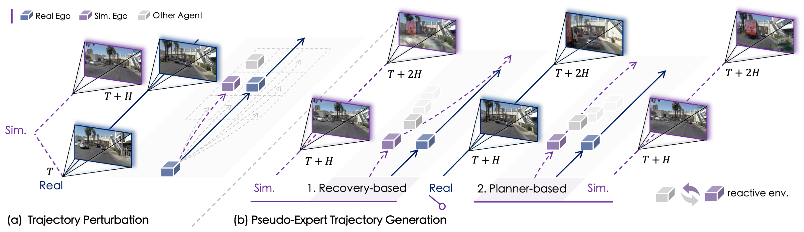

<div id="top" align="center">

<p align="center">
  
</p>

# **Learning to Drive via Real-World Simulation at Scale**

[](https://arxiv.org/abs/2511.23369)
[](https://opendrivelab.com/SimScale/) 
[](https://huggingface.co/datasets/OpenDriveLab/SimScale) 
[](https://modelscope.cn/datasets/OpenDriveLab/SimScale) 
[](https://github.com/OpenDriveLab/SimScale/blob/main/LICENSE) 

</div>

<div id="top" align="center">
<p align="center">

</p>
</div>


> [Haochen Tian](https://github.com/hctian713), 
> [Tianyu Li](https://github.com/sephyli), 
> [Haochen Liu](https://georgeliu233.github.io/), 
> [Jiazhi Yang](https://github.com/YTEP-ZHI), 
> [Yihang Qiu](https://github.com/gihharwtw),
> [Guang Li](https://scholar.google.com/citations?user=McEfO8UAAAAJ&hl=en),
> [Junli Wang](https://openreview.net/profile?id=%7EJunli_Wang4),
> [Yinfeng Gao](https://scholar.google.com/citations?user=VTn0hqIAAAAJ&hl=en),
> [Zhang Zhang](https://scholar.google.com/citations?user=rnRNwEMAAAAJ&hl=en),
> [Liang Wang](https://scholar.google.com/citations?user=8kzzUboAAAAJ&hl=en),
> [Hangjun Ye](https://scholar.google.com/citations?user=68tXhe8AAAAJ&hl=en),
> [Tieniu Tan](https://scholar.google.com/citations?user=W-FGd_UAAAAJ&hl=en), 
> [Long Chen](https://long.ooo/), 
> [Hongyang Li](https://lihongyang.info/)
> 
>
> - 📧 Primary Contact: Haochen Tian (tianhaochen2023@ia.ac.cn)
> - 📜 Materials: 🌐 [𝕏](https://x.com/OpenDriveLab/status/1999507869633527845) | 📰 [Media](https://mp.weixin.qq.com/s/OGV3Xlb0bHSSSloG11qFJA) | 🗂️ [Slides](https://docs.google.com/presentation/d/17qbsKZU9jdw7MfiPk7hZelaLb3leR2M76gPcMkuf1MI/edit?usp=sharing) | 🎬 [Talk (in Chinese)](https://www.bilibili.com/video/BV1tqrEBNECQ)
> - 🖊️ Joint effort by CASIA, OpenDriveLab at HKU, and Xiaomi EV.

---

## 🔥 Highlights 

- 🏗️ A scalable simulation pipepline that synthesizes diverse and high-fidelity reactive driving scenarios with pseudo-expert demonstrations. 
- 🚀 An effective sim-real co-training strategy that improves robustness and generalization synergistically across various end-to-end planners. 
- 🔬 A comprehensive recipe that reveals crucial insights into the underlying scaling properties of sim-real learning systems for end-to-end autonomy.


## 📢 News
- **`[2025/1/16]`** We released the data and models on 👾 ModelScope to better serve users in China.
- **`[2026/1/6]`** We released the code **v1.0**.
- **`[2025/12/31]`** We released the data and models **v1.0** on 🤗 Hugging Face. Happy New Year ! 🎄
- **`[2025/12/1]`** We released our [paper](https://arxiv.org/abs/2511.23369) on arXiv. 


## 📋 TODO List
- [x] More Visualization Results.
- [x] Future Sensors Data.
- [x] Sim-Real Co-training Code release (Jan. 2026).
- [x] Simulation Data release (Dec. 2025).
- [x] Checkpoints release (Dec. 2025).

---

## 📌 Table of Contents

- 🏛️ [Model Zoo](#%EF%B8%8F-model-zoo)
- 🎯 [Getting Started](#-getting-started)
- 📦 [Data Preparation](#-data-preparation)
  - [Download Dataset](#1-download-dataset)
  - [Set Up Configuration](#2-set-up-configuration)
- ⚙️ [Sim-Real Co-Training](#%EF%B8%8F-sim-real-co-training-recipe)
  - [Co-Training with Pseudo-Expert](#co-training-with-pseudo-expert)
  - [Co-Training with Rewards Only](#co-training-with-rewards-only)
- 🔍 [Inference](#-inference)
  - [NAVSIM v2 navhard](#navsim-v2-navhard)
  - [NAVSIM v2 navtest](#navsim-v2-navtest)
- ⭐ [License and Citation](#-license-and-citation) 

## 🏛️ Model Zoo

<table>
  <tr style="text-align: center;">
    <th rowspan="2">Model</th>
    <th rowspan="2">Backbone</th>
    <th rowspan="2">Sim-Real Config</th>
    <th colspan="2">NAVSIM v2 navhard</th>
    <th colspan="2">NAVSIM v2 navtest</t>

  </tr>

  <tr style="text-align: center;">
    <th>EPDMS</th>
    <th>CKPT</th>
    <th>EPDMS</th>
    <th>CKPT</th>
  </tr>

  <!-- LTF -->
  <tr>
    <td><a href="./navsim/planning/script/config/common/agent/transfuser_agent.yaml">LTF</a></td>
    <td>ResNet34</td>
    <td>w/ pseudo-expert</td>
    <td><a href="./assets/csv/LTF/ltf_sim_navhard.csv">30.3</a> | +6.9</td>
    <td><a href="https://huggingface.co/datasets/OpenDriveLab/SimScale/blob/main/SimScale_ckpts/LTF/ltf_sim_navhard.ckpt">HF</a> / 
    <a href="https://www.modelscope.cn/datasets/OpenDriveLab/SimScale/file/view/master/SimScale_ckpts%2FLTF%2Fltf_sim_navtest.ckpt?id=170866">MS</a></td>
    <td><a href="./assets/csv/LTF/ltf_sim_navtest.csv">84.4</a> | +2.9</td>
    <td><a href="https://huggingface.co/datasets/OpenDriveLab/SimScale/blob/main/SimScale_ckpts/LTF/ltf_sim_navtest.ckpt">HF</a> /
    <a href="https://www.modelscope.cn/datasets/OpenDriveLab/SimScale/file/view/master/SimScale_ckpts%2FLTF%2Fltf_sim_navhard.ckpt?id=170866">MS</a></td>
    </td>
  </tr>

  <!-- DiffusionDrive -->
  <tr>
    <td><a href="./navsim/planning/script/config/common/agent/diffusiondrive_agent.yaml">DiffusionDrive</a></td>
    <td>ResNet34</td>
    <td>w/ pseudo-expert</td>
    <td><a href="./assets/csv/DiffusionDrive/diffusiondrive_sim_navhard.csv">32.6</a> | +5.1</td>
    <td><a href="https://huggingface.co/datasets/OpenDriveLab/SimScale/blob/main/SimScale_ckpts/DiffusionDrive/diffusiondrive_sim_navhard.ckpt">HF</a> / 
    <a href="https://www.modelscope.cn/datasets/OpenDriveLab/SimScale/file/view/master/SimScale_ckpts%2FDiffusionDrive%2Fdiffusiondrive_sim_navhard.ckpt?id=170866">MS</a></td>
    <td><a href="./assets/csv/DiffusionDrive/diffusiondrive_sim_navtest.csv">85.9</a> | +1.7</td>
    <td><a href="https://huggingface.co/datasets/OpenDriveLab/SimScale/blob/main/SimScale_ckpts/DiffusionDrive/diffusiondrive_sim_navtest.ckpt">HF</a> / 
    <a href="https://www.modelscope.cn/datasets/OpenDriveLab/SimScale/file/view/master/SimScale_ckpts%2FDiffusionDrive%2Fdiffusiondrive_sim_navtest.ckpt?id=170866">MS</a></td>
    
  </tr>

  <!-- GTRS-Dense block -->
  <tr>
    <td rowspan="4"><a href="./navsim/planning/script/config/common/agent/gtrs_dense_vov.yaml">GTRS-Dense</a></td>
    <td rowspan="2">ResNet34</td>
    <td>w/ pseudo-expert</td>
    <td><a href="./assets/csv/GTRS_Dense/gtrs_dense_resnet_sim_expert_navhard.csv">46.1</a> | +7.8</td>
    <td><a href="https://huggingface.co/datasets/OpenDriveLab/SimScale/blob/main/SimScale_ckpts/GTRS_Dense/gtrs_dense_resnet_sim_expert_navhard.ckpt">HF</a> /
    <a href="https://www.modelscope.cn/datasets/OpenDriveLab/SimScale/file/view/master/SimScale_ckpts%2FGTRS_Dense%2Fgtrs_dense_resnet_sim_expert_navhard.ckpt?id=170866">MS</a></td>
    <td><a href="./assets/csv/GTRS_Dense/gtrs_dense_resnet_sim_expert_navtest.csv">84.0</a> | +1.7</td>
    <td><a href="https://huggingface.co/datasets/OpenDriveLab/SimScale/blob/main/SimScale_ckpts/GTRS_Dense/gtrs_dense_resnet_sim_expert_navtest.ckpt">HF</a> /
    <a href="https://www.modelscope.cn/datasets/OpenDriveLab/SimScale/file/view/master/SimScale_ckpts%2FGTRS_Dense%2Fgtrs_dense_resnet_sim_expert_navtest.ckpt?id=170866">MS</a></td>

  </tr>

  <tr>
    <td>rewards only</td>
    <td><a href="./assets/csv/GTRS_Dense/gtrs_dense_resnet_sim_expert_navhard.csv">46.9</a> | +8.6</td>
    <td><a href="https://huggingface.co/datasets/OpenDriveLab/SimScale/blob/main/SimScale_ckpts/GTRS_Dense/gtrs_dense_resnet_sim_reward_navhard.ckpt">HF</a> /
    <a href="https://www.modelscope.cn/datasets/OpenDriveLab/SimScale/file/view/master/SimScale_ckpts%2FGTRS_Dense%2Fgtrs_dense_resnet_sim_reward_navhard.ckpt?id=170866">MS</a></td>
    <td><a href="./assets/csv/GTRS_Dense/gtrs_dense_resnet_sim_reward_navtest.csv">84.6</a> | +2.3</td>
    <td><a href="https://huggingface.co/datasets/OpenDriveLab/SimScale/blob/main/SimScale_ckpts/GTRS_Dense/gtrs_dense_resnet_sim_reward_navtest.ckpt">HF</a> /
    <a href="https://www.modelscope.cn/datasets/OpenDriveLab/SimScale/file/view/master/SimScale_ckpts%2FGTRS_Dense%2Fgtrs_dense_resnet_sim_reward_navtest.ckpt?id=170866">MS</a></td>

  </tr>

  <tr>
    <td rowspan="2">V2-99</td>
    <td>w/ pseudo-expert</td>
    <td><a href="./assets/csv/GTRS_Dense/gtrs_dense_vov_sim_expert_navhard.csv">47.7</a> | +5.8</td>
    <td><a href="https://huggingface.co/datasets/OpenDriveLab/SimScale/blob/main/SimScale_ckpts/GTRS_Dense/gtrs_dense_vov_sim_expert_navhard.ckpt">HF</a> /
    <a href="https://www.modelscope.cn/datasets/OpenDriveLab/SimScale/file/view/master/SimScale_ckpts%2FGTRS_Dense%2Fgtrs_dense_vov_sim_expert_navhard.ckpt?id=170866">MS</a></td>
    <td><a href="./assets/csv/GTRS_Dense/gtrs_dense_vov_sim_expert_navtest.csv">84.5</a> | +0.5</td>
    <td><a href="https://huggingface.co/datasets/OpenDriveLab/SimScale/blob/main/SimScale_ckpts/GTRS_Dense/gtrs_dense_vov_sim_expert_navtest.ckpt">HF</a> /
    <a href="https://www.modelscope.cn/datasets/OpenDriveLab/SimScale/file/view/master/SimScale_ckpts%2FGTRS_Dense%2Fgtrs_dense_vov_sim_expert_navtest.ckpt?id=170866">MS</a></td>
  </tr>

  <tr>
    <td>rewards only</td>
    <td><a href="./assets/csv/GTRS_Dense/gtrs_dense_vov_sim_reward_navhard.csv">48.0</a> | +6.1</td>
    <td><a href="https://huggingface.co/datasets/OpenDriveLab/SimScale/blob/main/SimScale_ckpts/GTRS_Dense/gtrs_dense_vov_sim_reward_navhard.ckpt">HF</a> /
    <a href="https://www.modelscope.cn/datasets/OpenDriveLab/SimScale/file/view/master/SimScale_ckpts%2FGTRS_Dense%2Fgtrs_dense_vov_sim_reward_navhard.ckpt?id=170866">MS</a></td>
    <td><a href="./assets/csv/GTRS_Dense/gtrs_dense_vov_sim_reward_navtest.csv">84.8</a> | +0.8</td>
    <td><a href="https://huggingface.co/datasets/OpenDriveLab/SimScale/blob/main/SimScale_ckpts/GTRS_Dense/gtrs_dense_vov_sim_reward_navtest.ckpt">HF</a> /
    <a href="https://www.modelscope.cn/datasets/OpenDriveLab/SimScale/file/view/master/SimScale_ckpts%2FGTRS_Dense%2Fgtrs_dense_vov_sim_reward_navtest.ckpt?id=170866">MS</a></td>

  </tr>
</table>

> [!NOTE]
> We fixed a minor error in the simulation process without changing the method, resulting in better performance than the numbers reported in the arXiv version. We will update the arXiv paper soon.


## 🎯 Getting Started

### 1. Clone SimScale Repo

```bash
git clone https://github.com/OpenDriveLab/SimScale.git
cd SimScale
```

### 2. Create Environment

```bash
conda env create --name simscale -f environment.yml
conda activate simscale
pip install -e .
```

## 📦 Data Preparation

Our released simulation data is based on [nuPlan](https://www.nuscenes.org/nuplan) and [NAVSIM](https://github.com/autonomousvision/navsim). **We recommend first preparing the real-world data by following the instructions in [Download NAVSIM](https://github.com/autonomousvision/navsim/blob/main/docs/install.md#2-download-the-dataset). If you plan to use GTRS, please directly refer [Download NAVSIM](./docs/install.md#2-download-the-dataset).**

### 1. Download Dataset

We provide 🤗 [Script (Hugging Face)](./tools/download_hf.sh) and 👾 [Script (ModelScope)](./tools/download_ms) (users in China) for downloading the simulation data .

Our simulation data format follows that of [OpenScene](https://github.com/OpenDriveLab/OpenScene/blob/main/docs/getting_started.md#download-data), with each clip/log has a fixed temporal horizon of 6 seconds at 2 Hz (2 s history + 4 s future), which are stored separately in `sensor_blobs_hist` and `sensor_blobs_fut`, respectively. 
**For policy training, `sensor_blobs_hist` alone is sufficient.**

#### 📊  Overview Table of Simulated Synthetic Data

<table>
  <tr style="text-align: center;">
    <th rowspan="1">Split / Sim. Round</th>
    <th rowspan="1"># Tokens</th>
    <th rowspan="1">Logs</th>
    <th rowspan="1">Sensors_Hist</th>
    <th rowspan="1">Sensors_Fut</th>
    <th rowspan="1">Link</th>
  </tr>
  
  <th colspan="6">Planner-based Pseudo-Expert</th>

  <tr >
    <td><a href="./navsim/planning/script/config/common/train_test_split/scene_filter/navtrain_reaction_pdm_v1.0-0.yaml">reaction_pdm_v1.0-0</a></td>
    <td>65K</td>
    <td>9.9GB</td>
    <td>569GB</td>
    <td>1.2T</td>
    <td><a href="https://huggingface.co/datasets/OpenDriveLab/SimScale/tree/main/SimScale_data/synthetic_reaction_pdm_v1.0-0">HF</a>+ 
    <a href="https://huggingface.co/datasets/OpenDriveLab-org/SimScale/tree/main/SimScale_data/synthetic_reaction_pdm_v1.0-0">HF_Fut</a> /
    <a href="https://modelscope.cn/datasets/OpenDriveLab/SimScale/tree/master/SimScale_data/synthetic_reaction_pdm_v1.0-0">MS</a></td>
  </tr>

  <tr>
    <td><a href="./navsim/planning/script/config/common/train_test_split/scene_filter/navtrain_reaction_pdm_v1.0-1.yaml">reaction_pdm_v1.0-1</a></td>
    <td>55K</td>
    <td>8.5GB</td>
    <td>448GB</td>
    <td>964GB</td>
    <td><a href="https://huggingface.co/datasets/OpenDriveLab/SimScale/tree/main/SimScale_data/synthetic_reaction_pdm_v1.0-1">HF</a>+ 
    <a href="https://huggingface.co/datasets/OpenDriveLab-org/SimScale/tree/main/SimScale_data/synthetic_reaction_pdm_v1.0-1">HF_Fut</a> /
    <a href="https://modelscope.cn/datasets/OpenDriveLab/SimScale/tree/master/SimScale_data/synthetic_reaction_pdm_v1.0-1">MS</a></td>
  </tr>

  <tr>
    <td><a href="./navsim/planning/script/config/common/train_test_split/scene_filter/navtrain_reaction_pdm_v1.0-2.yaml">reaction_pdm_v1.0-2</a></td>
    <td>46K</td>
    <td>6.9GB</td>
    <td>402GB</td>
    <td>801GB</td>
    <td><a href="https://huggingface.co/datasets/OpenDriveLab/SimScale/tree/main/SimScale_data/synthetic_reaction_pdm_v1.0-2">HF</a>+ 
    <a href="https://huggingface.co/datasets/OpenDriveLab-org/SimScale/tree/main/SimScale_data/synthetic_reaction_pdm_v1.0-2">HF_Fut</a> /
    <a href="https://modelscope.cn/datasets/OpenDriveLab/SimScale/tree/master/SimScale_data/synthetic_reaction_pdm_v1.0-2">MS</a></td>
  </tr>

  <tr>
    <td><a href="./navsim/planning/script/config/common/train_test_split/scene_filter/navtrain_reaction_pdm_v1.0-3.yaml">reaction_pdm_v1.0-3</a></td>
    <td>38K</td>
    <td>5.6GB</td>
    <td>333GB</td>
    <td>663GB</td>
    <td><a href="https://huggingface.co/datasets/OpenDriveLab/SimScale/tree/main/SimScale_data/synthetic_reaction_pdm_v1.0-3">HF</a>+ 
    <a href="https://huggingface.co/datasets/OpenDriveLab-org/SimScale/tree/main/SimScale_data/synthetic_reaction_pdm_v1.0-3">HF_Fut</a> /
    <a href="https://modelscope.cn/datasets/OpenDriveLab/SimScale/tree/master/SimScale_data/synthetic_reaction_pdm_v1.0-3">MS</a></td>
  </tr>

  <tr>
    <td><a href="./navsim/planning/script/config/common/train_test_split/scene_filter/navtrain_reaction_pdm_v1.0-4.yaml">reaction_pdm_v1.0-4</a></td>
    <td>32K</td>
    <td>4.7GB</td>
    <td>279GB</td>
    <td>554GB</td>
    <td><a href="https://huggingface.co/datasets/OpenDriveLab/SimScale/tree/main/SimScale_data/synthetic_reaction_pdm_v1.0-4">HF</a>+ 
    <a href="https://huggingface.co/datasets/OpenDriveLab-org/SimScale/tree/main/SimScale_data/synthetic_reaction_pdm_v1.0-4">HF_Fut</a> /
    <a href="https://modelscope.cn/datasets/OpenDriveLab/SimScale/tree/master/SimScale_data/synthetic_reaction_pdm_v1.0-4">MS</a></td>
  </tr>

  <th colspan="6">Recovery-based Pseudo-Expert</th>

  <tr>
    <td><a href="./navsim/planning/script/config/common/train_test_split/scene_filter/navtrain_reaction_recovery_v1.0-0.yaml">reaction_recovery_v1.0-0</a></td>
    <td>45K</td>
    <td>6.8GB</td>
    <td>395GB</td>
    <td>789GB</td>
    <td><a href="https://huggingface.co/datasets/OpenDriveLab/SimScale/tree/main/SimScale_data/synthetic_reaction_recovery_v1.0-0">HF</a>+ 
    <a href="https://huggingface.co/datasets/OpenDriveLab-org/SimScale/tree/main/SimScale_data/synthetic_reaction_recovery_v1.0-0">HF_Fut</a> /
    <a href="https://modelscope.cn/datasets/OpenDriveLab/SimScale/tree/master/SimScale_data/synthetic_reaction_recovery_v1.0-0">MS</a></td>
  </tr>

  <tr>
    <td><a href="./navsim/planning/script/config/common/train_test_split/scene_filter/navtrain_reaction_recovery_v1.0-1.yaml">reaction_recovery_v1.0-1</td>
    <td>36K</td>
    <td>5.5GB</td>
    <td>316GB</td>
    <td>631GB</td>
    <td><a href="https://huggingface.co/datasets/OpenDriveLab/SimScale/tree/main/SimScale_data/synthetic_reaction_recovery_v1.0-1">HF</a>+ 
    <a href="https://huggingface.co/datasets/OpenDriveLab-org/SimScale/tree/main/SimScale_data/synthetic_reaction_recovery_v1.0-1">HF_Fut</a> /
    <a href="https://modelscope.cn/datasets/OpenDriveLab/SimScale/tree/master/SimScale_data/synthetic_reaction_recovery_v1.0-1">MS</a></td>
  </tr>

  <tr>
    <td><a href="./navsim/planning/script/config/common/train_test_split/scene_filter/navtrain_reaction_recovery_v1.0-2.yaml">reaction_recovery_v1.0-2</td>
    <td>28K</td>
    <td>4.3GB</td>
    <td>244GB</td>
    <td>488GB</td>
    <td><a href="https://huggingface.co/datasets/OpenDriveLab/SimScale/tree/main/SimScale_data/synthetic_reaction_recovery_v1.0-2">HF</a>+ 
    <a href="https://huggingface.co/datasets/OpenDriveLab-org/SimScale/tree/main/SimScale_data/synthetic_reaction_recovery_v1.0-2">HF_Fut</a> /
    <a href="https://modelscope.cn/datasets/OpenDriveLab/SimScale/tree/master/SimScale_data/synthetic_reaction_recovery_v1.0-2">MS</a></td>
  </tr>

  <tr>
    <td><a href="./navsim/planning/script/config/common/train_test_split/scene_filter/navtrain_reaction_recovery_v1.0-3.yaml">reaction_recovery_v1.0-3</td>
    <td>22K</td>
    <td>3.3GB</td>
    <td>189GB</td>
    <td>378GB</td>
    <td><a href="https://huggingface.co/datasets/OpenDriveLab/SimScale/tree/main/SimScale_data/synthetic_reaction_recovery_v1.0-3">HF</a>+ 
    <a href="https://huggingface.co/datasets/OpenDriveLab-org/SimScale/tree/main/SimScale_data/synthetic_reaction_recovery_v1.0-3">HF_Fut</a> /
    <a href="https://modelscope.cn/datasets/OpenDriveLab/SimScale/tree/master/SimScale_data/synthetic_reaction_recovery_v1.0-3">MS</a></td>
  </tr>

  <tr>
    <td><a href="./navsim/planning/script/config/common/train_test_split/scene_filter/navtrain_reaction_recovery_v1.0-4.yaml">reaction_recovery_v1.0-4</td>
    <td>17K</td>
    <td>2.7GB</td>
    <td>148GB</td>
    <td>296GB</td>
    <td><a href="https://huggingface.co/datasets/OpenDriveLab/SimScale/tree/main/SimScale_data/synthetic_reaction_recovery_v1.0-4">HF</a>+ 
    <a href="https://huggingface.co/datasets/OpenDriveLab-org/SimScale/tree/main/SimScale_data/synthetic_reaction_recovery_v1.0-4">HF_Fut</a> /
    <a href="https://modelscope.cn/datasets/OpenDriveLab/SimScale/tree/master/SimScale_data/synthetic_reaction_recovery_v1.0-4">MS</a></td>
  </tr>

</table>

> [!TIP]
> Before downloading, we recommend checking the table above to select the appropriate split and `sensor_blobs`.

#### 🏭 Simulation Data Pipeline

<div id="top" align="center">
<p align="center">

</p>
</div>

#### 🧩 Examples of Simulated Synthetic Data

<table align="center">
  <tr>
    <td align="center">
      <p>5c9694f15f9c5537</p>
      
    </td>
    <td align="center">
      <p>367cfa28901257ee</p>
      
    </td>
    <td align="center">
      <p>d37c49db3dcd59fa</p>
      
    </td>
  </tr>
  <tr>
    <td align="center">
      <p>Sim. 1</p>
      <br/>
      <p>Sim. 2</p>
      <br/>
      <p>Sim. 3</p>
      
    </td>
    <td align="center">
      <p>Sim. 1</p>
      <br/>
      <p>Sim. 2</p>
      <br/>
      <p>Sim. 3</p>
      
    </td>
    <td align="center">
      <p>Sim. 1</p>
      <br/>
      <p>Sim. 2</p>
      <br/>
      <p>Sim. 3</p>
      
    </td>
  </tr>
</table>


### 2. Set Up Configuration
We provide a [Script](./tools/move.sh) for moving the download simulation data to create the following structure.

```angular2html
navsim_workspace/
├── simscale/
├── exp/
└── dataset/
    ├── maps/
    ├── navsim_logs/
    │   ├── test/
    │   ├── trainval/
    │   ├── synthetic_reaction_pdm_v1.0-*/
    │   │   ├── [log]-00*.pkl
    │   │   └── ...
    │   └── synthetic_reaction_recovery_v1.0-*/
    ├── sensor_blobs/
    │   ├── test/
    │   ├── trainval/
    │   ├── synthetic_reaction_pdm_v1.0-*/
    │   │   └── [token]-00*/
    │   │       ├── CAM_B0/
    │   │       └── ...
    │   └── synthetic_reaction_recovery_v1.0-*/
    └── navhard_two_stage/
```

## ⚙️ Sim-Real Co-Training Recipe

### Preparation
1. Refer the [Script](./scripts/training/run_dataset_cache.sh) to cache the real-world and simulation data.
2. Download pretrained image backbone weight, [ResNet34](https://huggingface.co/timm/resnet34.a1_in1k) or [V2_99](https://drive.google.com/file/d/1gQkhWERCzAosBwG5bh2BKkt1k0TJZt-A/view).


### Co-Training with Pseudo-Expert
We provide [Scripts](./scripts/training) for sim–real co-training, 
*e.g.*, [run_diffusiondrive_training_syn.sh](./scripts/training/run_diffusiondrive_training_syn.sh).

The main configuration options are as follows:
```bash
export SYN_IDX=0   # 0, 1, 2, 3, 4
export SYN_GT=pdm  # pdm, recovery
```
- `SYN_IDX` specifies which rounds of simulation data are included; *e.g.*, `SYN_IDX=2` means that rounds 0, 1, and 2 will be used.
- `SYN_GT` specifies the type of pseudo-expert used for supervision.


In addition, the cache path for simulation data is hard-coded in [dataset.py#136](./navsim/planning/training/dataset.py#L136). Please make sure the path is correctly set to your local simulation data directory before training.
- **Regression-based Policy | *LTF***

We provide a [Script](./scripts/training/run_transfuser_training_syn.sh) to train LTF with 8 GPUs for 100 epochs.

- **Diffusion-based Policy | *DiffusionDrive***

We provide a [Script](./scripts/training/run_diffusiondrive_training_syn.sh) to train DiffusionDrive with 8 GPUs for 100 epochs.

- **Scoring-based Policy | *GTRS-Dense***

We provide a [Script](./scripts/training/run_gtrs_dense_training_multi_syn.sh) to train GTRS_Dense on 4 nodes, each with 8 GPUs, for 50 epochs.

We also provide 🤗 [Reward Files (Hugging Face)](https://huggingface.co/datasets/OpenDriveLab/SimScale/tree/main/SimScale_rewards) and 👾 [Reward Files (ModelScope)](https://www.modelscope.cn/datasets/OpenDriveLab/SimScale/tree/master/SimScale_rewards) (users in China) for rewards in simulation data.  Please download correspending files first and move them to `NAVSIM_TRAJPDM_ROOT/sim`. The reward files path is hard-coded in [gtrs_agent.py#223](./navsim/agents/gtrs_dense/gtrs_agent.py#223). Check it before training.
 

### Co-Training with Rewards Only

- **Scoring-based Policy | *GTRS-Dense***

It uses the same training 
[Script](./scripts/training/run_gtrs_dense_training_multi_syn.sh),
to train GTRS_Dense on 4 nodes, each with 8 GPUs, for 50 epochs.

The main configuration option is as follows:
```bash
syn_imi=false  # true, false
```
- `syn_imi`: When set to `false`, the imitation learning loss is disabled for simulation data, while it remains enabled for real-world data.
## 🔍 Inference

### Preparation

Refer the [Script](./scripts/evaluation/run_metric_caching.sh) to cache metric first.

### NAVSIM v2 navhard

We provide [Scripts](./scripts/evaluation_navhard) to evaluate three policies on [navhard](./navsim/planning/script/config/common/train_test_split/scene_filter/navhard_two_stage.yaml) using GPU inference.

### NAVSIM v2 navtest

We provide [Scripts](./scripts/evaluation_navtest) to evaluate three policies  on [navtest](./navsim/planning/script/config/common/train_test_split/scene_filter/navtest.yaml) using GPU inference.

## ❤️ Acknowledgements

We acknowledge all the open-source contributors for the following projects to make this work possible:

- [NAVSIM](https://github.com/autonomousvision/navsim) | [MTGS](https://github.com/OpenDriveLab/MTGS) | [GTRS](https://github.com/NVlabs/GTRS) | [DiffusionDrive](https://github.com/hustvl/DiffusionDrive)

## ⭐ License and Citation

All content in this repository is under the [Apache-2.0 license](https://www.apache.org/licenses/LICENSE-2.0).
The released data is based on [nuPlan](https://www.nuscenes.org/nuplan) and is under the [CC-BY-NC-SA 4.0](https://creativecommons.org/licenses/by-nc-sa/4.0/) license.

If any parts of our paper and code help your research, please consider citing us and giving a star to our repository.

```bibtex
@article{tian2025simscale,
  title={SimScale: Learning to Drive via Real-World Simulation at Scale},
  author={Haochen Tian and Tianyu Li and Haochen Liu and Jiazhi Yang and Yihang Qiu and Guang Li and Junli Wang and Yinfeng Gao and Zhang Zhang and Liang Wang and Hangjun Ye and Tieniu Tan and Long Chen and Hongyang Li},
  journal={arXiv preprint arXiv:2511.23369},
  year={2025}
}
```
